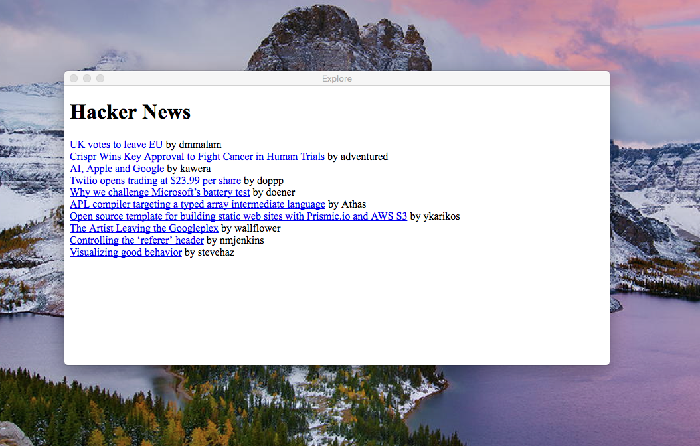

# explore



# Getting Started

## Development
```
npm start
// same as
npm start -- --env=development
```

## Production
```
npm start -- --env=production
```

## Build
```
npm run build
```

## License

MIT © [derekrliang](https://github.com/derekrliang)